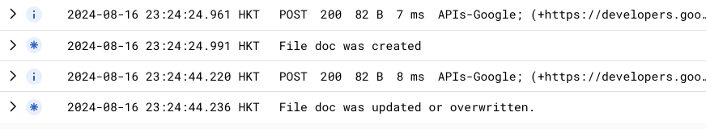

# Repro for issue 7560

## Environment Info

firebase-tools: v13.15.1<br>
node: v20.12.2<br>
platform: macOS 14.5

## Steps to reproduce

### Emulator

1. Run `firebase emulators:start --project PROJECT_ID`
2. Open http://127.0.0.1:5000
3. Upload `foo.png`
   - Click the "Choose File" button
   - Choose `foo.png` located in `./images/foo.png`
   - Click "Upload"
   - Logs in emulator terminal show

```
i  functions: Beginning execution of "us-central1-onFileCreated"
i  functions: Finished "us-central1-onFileCreated" in 133.266083ms
i  functions: Beginning execution of "us-central1-onFileDocWritten"
>  File doc was created
i  functions: Finished "us-central1-onFileDocWritten" in 10.095083ms
```

4. Refresh Page http://127.0.0.1:5000
5. Upload `foo.png` again
   - Click the "Choose File" button
   - Choose `foo.png` located in `./images/foo.png`
   - Click "Upload"
   - Logs in emulator terminal show

```
i  functions: Beginning execution of "us-central1-onFileCreated"
i  functions: Beginning execution of "us-central1-onFileDocWritten"
i  functions: Finished "us-central1-onFileCreated" in 43.822792ms
>  File doc was updated or overwritten.
i  functions: Finished "us-central1-onFileDocWritten" in 6.265834ms
```

### Production

1. Run `firebase deploy`
2. Open https://SITE_ID.web.app
3. Upload `foo.png`

   - Click the "Choose File" button
   - Choose `foo.png` located in `./images/foo.png`
   - Click "Upload"

4. Refresh Page https://SITE_ID.web.app
5. Upload `foo.png` again

   - Click the "Choose File" button
   - Choose `foo.png` located in `./images/foo.png`
   - Click "Upload"
   - Logs in emulator terminal show

6. Function logs show "File doc was updated or overwritten."

   
